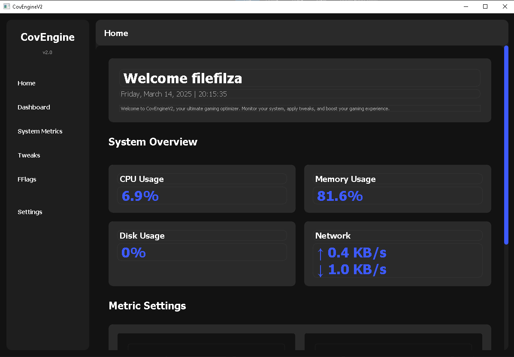

# CovEngineV2

CovEngineV2 is an open source project that aims to optimize your PC for gaming performance.

.png)

## Project Structure

This project is divided into two main parts:

- **FE**: Frontend based on Python Qt
- **BE**: Backend in C/C++

## Latest Changes (v1.5)

HWID Spoof (UD + Normal)

## Features

- System optimization tweaks for gaming
- User-friendly interface
- Customizable optimization profiles
- System restore point creation for safety
- System metrics

## Getting Started

See [BUILD_INSTRUCTIONS.md](./BUILD_INSTRUCTIONS.md) for details on how to build and run the application.

Or, download the latest release thats already built.

## Community

Join our Discord server to get help, share feedback, and connect with other users:

[Join the CovEngineV2 Discord](https://discord.gg/btHSfdSg)
